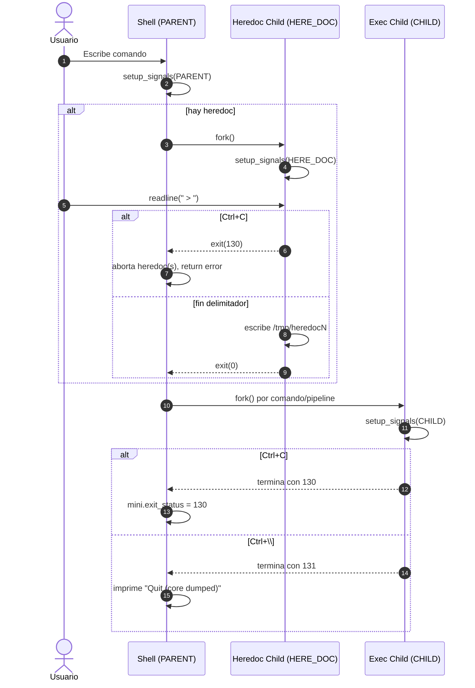

### Flujo de señales en Minishell

Este documento describe cómo se configuran y manejan las señales en el proyecto, desde el prompt hasta la ejecución de comandos y el modo heredoc. Incluye un diagrama en Mermaid.

---

#### Modos de señales
- **PARENT**: activo en el bucle del prompt.
  - `SIGINT` → limpia la línea actual, imprime salto y re-dibuja prompt.
  - `SIGQUIT` → ignorado.
- **CHILD**: procesos hijos que ejecutan comandos.
  - `SIGINT` → imprime salto de línea; el hijo termina con 130 si no manejado por el comando.
  - `SIGQUIT` → imprime salto de línea personalizado; si no se gestiona, termina con 131.
- **HERE_DOC**: proceso lector del heredoc.
  - `SIGINT` → aborta heredoc inmediatamente con `exit(130)`.
  - `SIGQUIT` → ignorado.

Handlers implementados en `src/signals/signals.c` y `src/signals/signals_utils.c`.

---

#### Secuencia típica de señales
1. Prompt inicial configura `PARENT`.
2. Al ejecutar un pipeline:
   - Cada proceso hijo configura `CHILD`.
   - Si hay `<<`, el heredoc se realiza en un hijo aparte con `HERE_DOC`.
3. Eventos:
   - `Ctrl+C` en prompt: handler `PARENT` limpia línea y redibuja, `exit_status` no cambia a menos que se defina política.
   - `Ctrl+C` durante heredoc: el hijo heredoc sale con 130; el padre detecta `WIFSIGNALED(SIGINT)`, corta el resto de heredocs y retorna error.
   - `Ctrl+C` en ejecución de comando: el hijo termina con 130; el padre actualiza `mini->exit_status = 130`.
   - `Ctrl+\` en ejecución: hijo termina con 131; el padre imprime "Quit (core dumped)" y fija 131.

---

#### Diagrama (Mermaid)

Nota: la configuración concreta de señales está en `setup_signals`.

